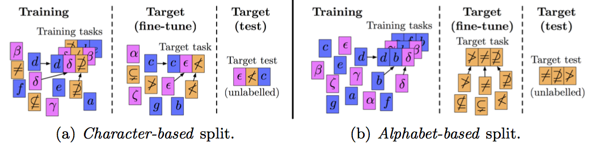
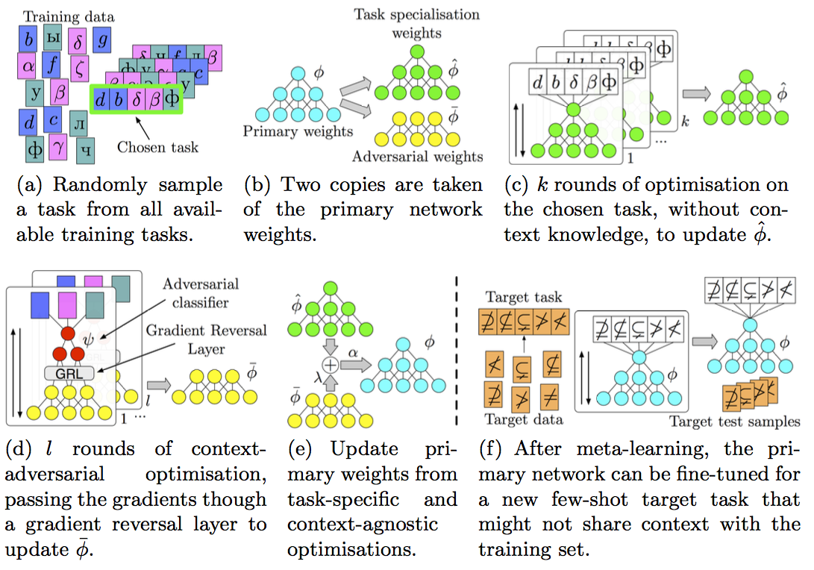

<p align="center" style="font-size:30px">
<a href="https://tobyperrett.github.io/">Toby Perrett</a> and <a href="https://dimadamen.github.io/">Dima Damen</a>
</p>


## Abstract

Meta-learning approaches have addressed few-shot problems by finding initialisations suited for fine-tuning to target tasks. Often there are additional properties within training data (which we refer to as context), not relevant to the target task, which act as a distractor to meta-learning, particularly when the target task contains examples from a novel context not seen during training. 

We address this oversight by incorporating a context-adversarial component into the meta-learning process. This produces an initialisation which is both context-agnostic and task-generalised. We evaluate our approach on three commonly used meta-learning algorithms and four case studies. We demonstrate our context-agnostic meta-learning improves results in each case. First, we report few-shot character classification on the Omniglot dataset, using alphabets as context. An average improvement of 4.3% is observed across methods and tasks when classifying characters from an unseen alphabet. Second, we perform few-shot classification on Mini-ImageNet, obtaining context from the label hierarchy, with an average improvement of 2.8%.  Third, we perform few-shot classification on CUB, with annotation metadata as context, and demonstrate an average improvement of 1.9%. Fourth, we evaluate on a dataset for personalised energy expenditure predictions from video, using participant knowledge as context. We demonstrate that context-agnostic meta-learning decreases the average mean square error by 30%.

## Context in Few-shot Problems



## Method




## Video


<iframe align="center" width="640" height="360" src="https://www.youtube.com/embed/..." frameborder="0" allow="accelerometer; autoplay; encrypted-media; gyroscope; picture-in-picture" allowfullscreen></iframe>


## Paper

[ArXiv](https://arxiv.org/pdf/2007.14658.pdf)

## Bibtex

```markdown
@InProceedings{perrettdamen20ddlstm,
    author    = {Perrett, Toby and Masullo, Alessandro and Burghardt, Tilo and Mirmehdi, Majid and Damen, Dima},
    title     = {Meta-Learning with Context-Agnostic Initialisations},
    booktitle = {Asian Conference on Computer Vision (ACCV)},
    year      = {2020}
}
```


